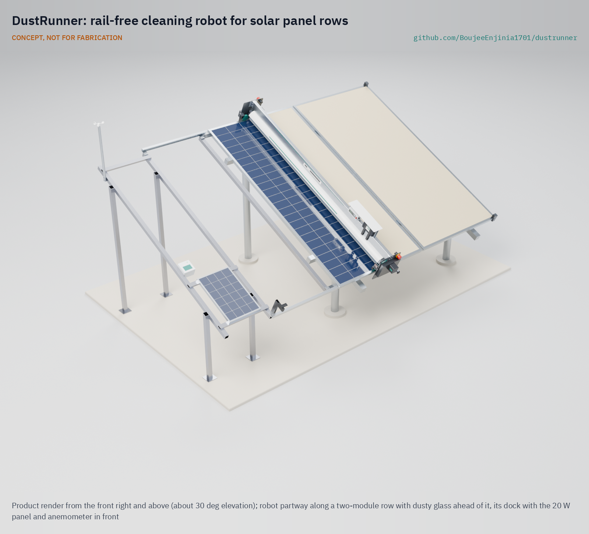

# DustRunner

     

**Area:** CleanTech · **TRL:** 3 of 9 (proof of concept on paper) · **Prototype budget:** about $500 USD · **Difficulty:** 4 of 5

Rail-free crawler robot that uses a rotating microfiber brush to dry-clean panel rows, clamps onto panel edges and docks to recharge.

[Exploded render](media/render-exploded.png) · [Detail render](media/render-detail.png) · [Interactive 3D model](media/viewer.html) · [Concept blueprint (PDF)](media/concept-blueprint.pdf) · [General arrangement DRN-DWG-001 (PDF)](cad/drawings/DRN-DWG-001.pdf) · [Sizing calculations](docs/04-calcs/01-sizing.md) · [Review note](docs/REVIEW.md)

## Concept rationale

Soiling is a daily, gradual loss, so the answer is a small cleaning every day rather than a large one every month. Utility plants already do this with water-free robots bought as a service, but those machines are sized, priced and sold for rows hundreds of meters long. DustRunner scales the same idea down to one row of a small array: a full-width brush that rides on the module frames, so it needs no rails, never loads the glass and cannot fall between modules, and a dock that recharges it from a 20 W panel so it needs no wiring to the array.

The design is open and garage-buildable because the owners who need it most, farms with solar pumps, mini-grids and schools in dry regions, are far from robot vendors and service contracts. Aluminum tube, hobby gearmotors, a LiFePO4 pack and a microfiber sleeve can be bought, cut and repaired locally, and an open design can be adapted to other module lengths and table formats.

## Burning platform

Soiling cost at least 3 to 4 % of the world's solar electricity production in 2018, worth about 3 to 5 billion euros of lost revenue, with 4 to 7 % projected for 2023 as capacity grows fastest in dusty, sunny regions ([Ilse et al., Joule, 2019](https://www.cell.com/joule/fulltext/S2542-4351(19)30422-2)). The loss is steep where the sun is strongest: a 2026 study for Arar, Saudi Arabia, assumed monthly soiling losses of about 4 % in winter rising to 15 % in June and July ([Alharbi, *Energies*, 2026](https://www.mdpi.com/1996-1073/19/18/4373)).

Washing is the usual fix, and it spends water in the places that have least of it. Because each manual wash costs labor, the cost-optimal manual interval in the same study came out at about 60 days, and longer at low tariffs ([Alharbi, 2026](https://www.mdpi.com/1996-1073/19/18/4373)), so the array runs dirty for most of that time. A cheap daily dry pass changes that trade-off.

## Where it could be used

### By industry

| Industry | Use |
| --- | --- |
| Agriculture | Solar irrigation pumping arrays on farms, cleaned daily without trucking in water |
| Rural electrification | Mini-grid and community solar arrays at remote sites visited weekly or less |
| Commercial and light industrial | Ground-mounted arrays of 10 to 200 kW at warehouses, factories and depots |
| Education and health | School and clinic solar systems where no one is paid to clean panels |
| Water and telecoms utilities | Small arrays powering pumping stations, treatment plants and remote masts |
| Research and training | University test arrays and technical colleges comparing cleaning regimes |

### By country or region

| Country or region | Why it matters there |
| --- | --- |
| Saudi Arabia and the Gulf | Desert dust and scarce fresh water; a 2026 study for Arar assumed monthly soiling losses rising to 15 % in June and July ([Alharbi, 2026](https://www.mdpi.com/1996-1073/19/18/4373)) |
| Sahel and West Africa (for example Niger, Mali) | Harmattan dust from the Sahara can cut the output of decentralized solar and mini-grids by more than 50 % in the dry season, and Bamako needed about 21 cleanings a year to keep losses below 1 % ([Isaacs et al., *Applied Energy*, 2023](https://www.sciencedirect.com/science/article/abs/pii/S0306261923003574)) |
| India (Rajasthan, Gujarat) | More than 295,000 off-grid solar water pumps had been installed under the PM-KUSUM scheme by January 2024, about 59,700 of them in Rajasthan ([Press Information Bureau, 2024](https://www.pib.gov.in/PressReleaseIframePage.aspx?PRID=2004183&reg=3&lang=2)) |
| Chile (Atacama) | The Atacama has the highest long-term solar irradiance measured anywhere on Earth, with clouds present less than 5 % of the time in places, so arrays there are rarely washed by rain ([Molina, Falvey and Rondanelli, *Scientific Reports*, 2017](https://www.nature.com/articles/s41598-017-13761-x)) |
| Australia (inland) | A high-income market where ten deserts cover nearly 20 % of the country, the second driest continent ([Geoscience Australia](https://www.ga.gov.au/scientific-topics/national-location-information/landforms/deserts)) |

## What sparked the idea

The idea traces back to NASA's InSight lander on Mars, whose mission ended in December 2022 after dust gradually covered its solar panels and its batteries ran out of energy. With no cleaning mechanism on board, the team improvised: on windy days they sprinkled soil from the arm's scoop onto the panels so the falling grains would sweep some dust away and win back a little power ([NASA, "NASA Retires InSight Mars Lander Mission After Years of Science", 2022](https://www.nasa.gov/missions/insight/nasa-retires-insight-mars-lander-mission-after-years-of-science/)). The lesson carries back to Earth's deserts: a solar array without water depends on some dry, regular way of moving dust off the glass, and a small array needs one that costs no more than the energy it saves.

## Problem

Soiling cuts output of PV arrays in dusty regions by up to 15 to 25% a month in the dusty season, and water for washing is scarce.

## Concept

Rail-free crawler robot that uses a rotating microfiber brush to dry-clean panel rows, clamps onto panel edges and docks to recharge.

The robot spans one table from its lower to its upper module edge. End trucks ride on the module frames and hook under the frame lips, so no rails are needed along the row. A 2.2 m microfiber brush sweeps the glass dry once a day in the evening, and the robot parks off the glass in a clamp-on dock where a 20 W panel recharges its 12.8 V LiFePO4 pack and an anemometer checks the wind before each run. The TRL 3 calculations (DRN-CAL-001) give, for a 40 m, 20 kWp row, about 7.4 minutes and 7.6 Wh per cycle, a 13.8 kg robot and $500 in parts for robot, dock and anemometer, with a payback of about 2.8 years on rows of 60 m. Seven of fifteen requirements are met on paper and four are at risk, chiefly traction in wind and a budget with no margin. Runs start only when the dock anemometer reads below 6 m/s and abort at 8 m/s (DRN-DDR-002). These are calculations, not test results.

Full design precis: [docs/02-concept.md](docs/02-concept.md)

## Key components

- Microfiber brush, 120 mm x 2.2 m, with brush motor and hood
- End trucks with belt-linked wheels and two drive gearmotors
- Edge-guide and hook rollers (the rail-free "clamp")
- 12.8 V 10 Ah LiFePO4 pack
- Controller (ESP32 class) and IR edge sensors
- Clamp-on dock with a 20 W PV panel, charger and anemometer; clamp-on end stops

The priced bill of materials is in [bom/bom.csv](bom/bom.csv); the parametric model is [cad/src/model.py](cad/src/model.py), with STEP files in `cad/step/`.

## Repository layout

| Folder | Contents |
| --- | --- |
| `docs/` | Problem, concept, requirements, calculations and design decisions |
| `cad/src/` | build123d Python source, the source of truth for all geometry |
| `cad/step/`, `cad/stl/` | Exported models for FreeCAD, other CAD tools and printing |
| `cad/drawings/` | 2D sketches and dimensioned drawings |
| `bom/` | Bill of materials |
| `electronics/` | KiCad schematics and PCB layouts |
| `firmware/` | Microcontroller code |
| `media/` | Renders, perspectives and photos |
| `build-log/` | Dated prototyping notes |

## Documentation

Controlled documents follow the portfolio [documentation standard](.kit/STANDARDS.md). Each carries a document ID (DRN-PRC-001 for the precis), a version and a revision history. Branded PDFs are built with `python .kit/render.py` and attached to GitHub Releases when a document is tagged, for example `DRN-PRC-001/v1.0`.

## Credits

Designed by Amish Chadha. See [CONTRIBUTORS.md](CONTRIBUTORS.md) for roles. To cite this design, use [CITATION.cff](CITATION.cff) (GitHub shows it as "Cite this repository").

AI assistance (Claude) was used to accelerate concept renders, prototype documentation and first-pass sizing calculations. Design direction and all decisions are Amish Chadha's, recorded in this repository's decision records (`docs/decisions/`).

## Licenses

- **Hardware** (CAD, drawings, BOM, electronics): [CERN-OHL-S v2](LICENSE)
- **Software** (firmware, scripts, notebooks): [MIT](LICENSE-SOFTWARE)

A project of the [Design Molecule](https://designmolecule.com) lab.
