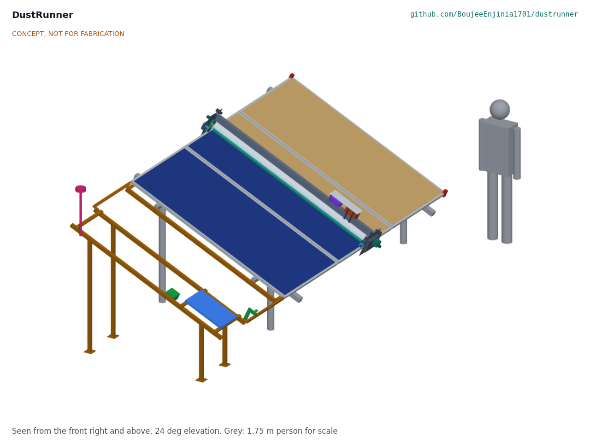
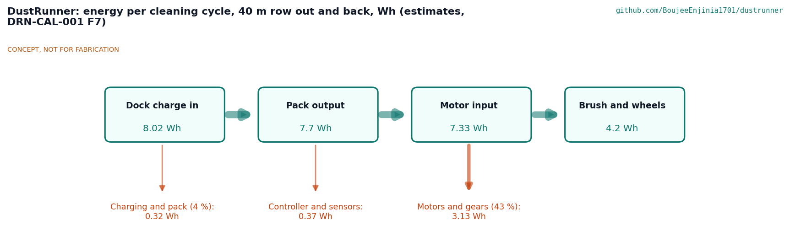
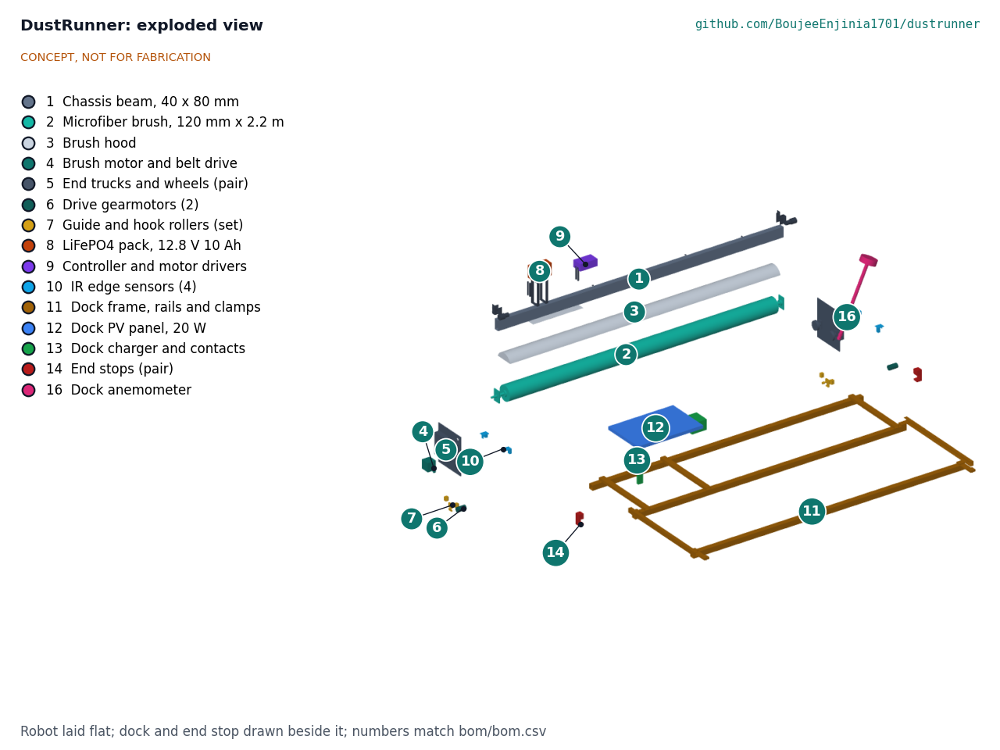
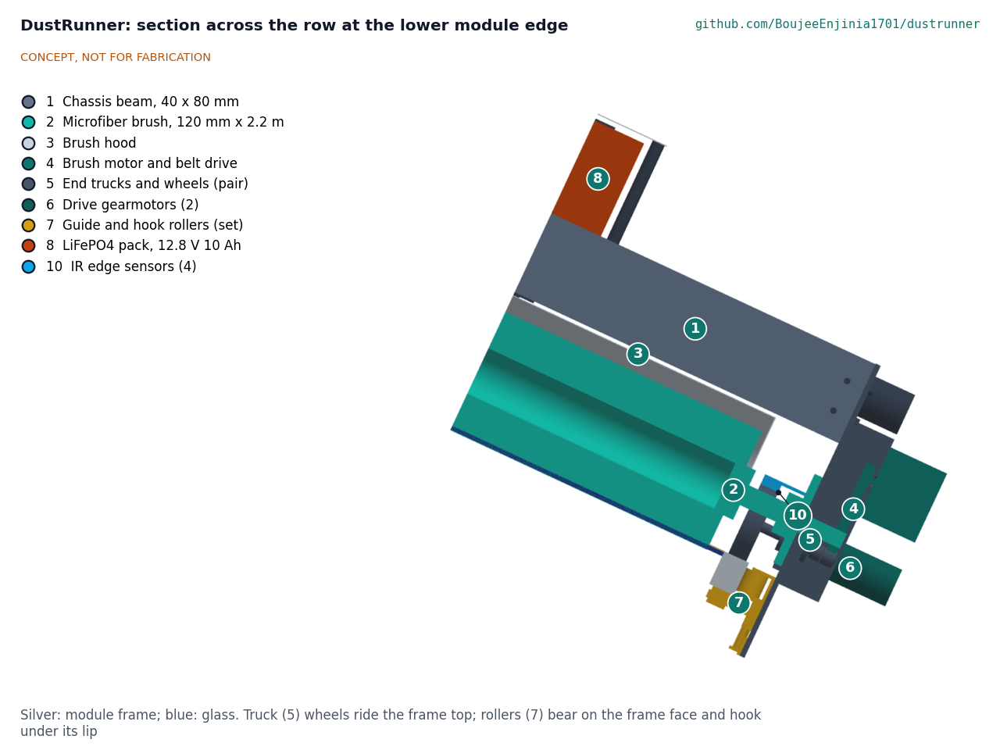

# DustRunner design precis

## Summary

DustRunner is a rail-free crawler robot that spans one PV table from its lower to its upper module edge, rides along the module frames on two end trucks that hook under the frame lips, and sweeps the glass dry with a 2.2 m rotating microfiber brush. It parks off the glass in a clamp-on dock at the start of the row, where a 20 W panel recharges its 12.8 V LiFePO4 pack and a cup anemometer tells it whether the wind allows a run. The TRL 3 calculations (DRN-CAL-001 v0.3), run on the constructable design of DRN-DDR-003, give for the 40 m, 20 kWp reference row about 7.4 minutes and 7.7 Wh per out-and-back cycle, a robot of about 15.9 kg and $573 in parts for robot, dock and anemometer. The bearings, housings, brackets and fittings that make the design buildable added about 2.1 kg and $73, so three requirements are now not met: the 15 kg mass limit of R10 (every wheel load still meets R10), the $500 budget of R13, and R14, with a payback of 3.2 years on a 60 m row (met from 63.5 m). Five are met and three are at risk: 5 mm frame steps (R4), traction in wind along the row (R9) and pack temperature (R11). A run starts only below 6 m/s at the dock anemometer and aborts above 8 m/s (DRN-DDR-002). How to resolve R10, R13 and R14 is open for Amish in the design decisions register ([06-design-decisions.md](06-design-decisions.md)); how to build the prototype is in the build plan ([05-build-plan.md](05-build-plan.md)).

*Figure 1. DustRunner partway along a three-module section of the reference table, moving away from its dock (brown, left, with the anemometer mast) toward the end stops (red). Glass behind the robot is clean; tan shows dust still to be removed. Grey figure: 1.75 m person for scale.*

## How it works

1. **Park and charge.** Between cycles the robot sits in the dock, a short pair of rails that continue the module frame profile past the end of the row. Parking off the glass means the robot never shades the array. A 20 W panel in the dock charges the pack through spring contacts; a third contact carries the anemometer signal.
2. **Start.** Once a day, in the evening after the array's output has dropped and before dew forms (DRN-DDR-001, D2), the controller checks pack charge, air humidity and the wind at the dock anemometer, sounds a short warning, then drives out of the dock. It starts only if the wind is below 6 m/s (DRN-DDR-002, N1).
3. **Travel.** Two end trucks carry the robot along the row. Each truck has two 70 mm polyurethane wheels on the top flange of the module frame, two guide rollers against the outer face of the frame and a hook roller under the frame's bottom flange, pushed up by a spring to 60 N. The trucks are the "clamp": they cannot lift off or slide down the slope, yet need no rail. A gearmotor with an encoder on each truck drives both of that truck's wheels through a toothed belt, and the controller keeps the two ends in step.
4. **Clean.** A 120 mm microfiber brush on a 50 mm aluminum core spans the slope and turns at about 150 rpm, pressed 4.5 mm into the glass plane at its bearings. A helical pattern on the brush conveys the loosened dust down the slope and off the lower edge. A hood over the brush limits dust thrown back onto clean glass.
5. **Stop and return.** IR sensors on each truck see the frame end; a clamp-on end stop at the far end is the mechanical backstop. The robot reverses the brush and cleans on the way back, then docks and latches. If the wind reported by the dock rises above 8 m/s during a run, the robot stops the brush and returns to the dock at once.

*Figure 2. Energy for one out-and-back cycle on the 40 m reference row, in Wh (DRN-CAL-001, F7). All values are estimates.*

## Main components

Numbers match the exploded view (Figure 3) and `bom/bom.csv`. Geometry is in `cad/src/model.py` and drawing DRN-DWG-001.

*Table 1. Main components.*

| # | Component | Choice | Notes |
| --- | --- | --- | --- |
| 1 | Chassis beam | 40 x 80 x 2 mm 6063 aluminum tube, 2,334 mm, bolted to each truck plate by two angle cleats | Cut to the module length for other tables |
| 2 | Microfiber brush | 120 mm diameter, 2,198 mm brushed length, on a 50 x 2 mm aluminum core | The 50 mm core keeps the interference at 3.4 to 4.4 mm along the brush |
| 3 | Brush hood | 0.8 mm aluminum sheet, 77 mm radius, with end guards and a sunshade over the pack | Also the finger guard at the brush ends |
| 4 | Brush motor and belt drive | 12 V DC gearmotor, about 60 W, toothed belt | Reversible; about 150 rpm at the brush; about 47 W in use |
| 5 | End trucks and wheels | 5 mm aluminum plates, 260 x 296 mm; two 70 x 18 mm polyurethane wheels each at 180 mm wheelbase on axles in flange bearings, belt-linked inside a drive housing that carries the motors | Wheels run on the frame top flange only |
| 6 | Drive gearmotors | Two 12 V 37 mm gearmotors with encoders, one per truck | Synchronized in firmware |
| 7 | Guide and hook rollers | 22 mm guide rollers in clevises on the frame face; 16 mm hook rollers on sprung sliders under the frame bottom flange, 60 N preload per truck | Keep the robot on the table in wind |
| 8 | Battery | LiFePO4, 12.8 V, 10 Ah (128 Wh) with BMS and temperature cut-offs | Under the sunshade |
| 9 | Controller | ESP32-class board, two drive channels, brush driver, current sensing, humidity and temperature sensor, IP65 box | Firmware is a sketch until TRL 4 |
| 10 | IR edge sensors | Four downward-looking reflective sensors, two per truck | Row-end and gap detection |
| 11 | Dock frame | Aluminum C-section rails continuing the module frame profile on brackets above three cross members, which stay clear of the hook roller path; two clamps to the first module's frame flange; ties; four legs | Clamp-on; no drilling |
| 12 | Dock PV panel | 20 W, about 530 x 350 mm, in the table plane | Charges the parked robot |
| 13 | Dock charger and contacts | LiFePO4 charge controller, three spring contacts on a post, latch tab; on the robot a contact block and a 12 V solenoid whose 6 mm pin drops into the tab | |
| 14 | End stops | Pair of three-piece clamps round the last module's frame edge, held by a clamp screw, with rubber buffers; low enough for the IR sensors to pass over | Mechanical backstop; the wheels meet the buffers |
| 16 | Dock anemometer | Cup anemometer with pulse output on a vertical mast clamped to the dock | Read before each start (DRN-DDR-001, D3) |

Item 15 (wiring, fuse, switches, stop buttons and fasteners) has no callout.

*Figure 3. Exploded view with numbered callouts matching the BOM. The robot is laid flat in the table plane; the dock and end stops are drawn beside it. Upper-end twins of paired parts are shown without numbers.*

*Figure 4. Section across the row through the robot at the lower module edge, showing how the end truck wraps the frame.*

## Numbers at TRL 3

All values are from DRN-CAL-001 v0.2, which prints each from `docs/04-calcs/sizing.py`. They are first-principles estimates; the assumptions behind them (pile pressure, friction coefficients, frame flange width) are listed there and must be measured.

*Table 2. Key numbers.*

| Quantity | Value | Requirement |
| --- | --- | --- |
| Robot mass | 15.9 kg, including about 2.1 kg added for construction | R10 not met (15 kg) |
| Brush contact | About 67 N on the glass, 30 N drag, 28 W mechanical (13 to 50 W over the assumed ranges) | |
| Electrical power while cleaning | 67 W (brush 47 W, drives 17 W, electronics 3 W) | |
| Wheel load | 55 N brushing at 25°; 58 N at worst tilt; about 72 N for about a second at row entry | R10 met (75 N allowed for the transient, DRN-DDR-002) |
| Traction margin, friction 0.4 | 1.79 in still air; 1.30 at the 6 m/s start limit; 1.07 at the 8 m/s abort limit (0.98 and 0.81 at friction 0.3) | R9 at risk |
| 5 mm frame step | About 9 N extra push needed, about 14 N spare | R4 at risk |
| Parked at 35 m/s | 555 N along the row on a latch rated about 2.8 kN; 137 N net lift on the hook rollers | R9 parked case met |
| 40 m row, out and back | 7.4 min; 7.6 Wh from the pack | |
| 100 m row, out and back | 17.4 min; 19.6 Wh from the dock | R7 met |
| Autonomy | Three 100 m cycles and three days of standby use 67 of 102 Wh; 9 days with no sun on the 40 m row | R8 met |
| Dock harvest | 45 Wh/day at 3 sun hours; 82 Wh/day at 5.5 | R8 met |
| Coverage | 98.4 % of the glass on the 40 m row | R5 met |
| Stopping | Brush 0.13 s, robot 0.06 s after power is cut | R12 met |
| Parts cost | $573.00 (16 lines) | Over the value-engineering target by USD 73 (R13, target $500) |
| Payback, mid case | 3.2 years on a 60 m row (3 years from 63.5 m); 1.9 years on 100 m; 4.7 years on the 40 m reference row | R14 not met as restated |

The pack is cycled lightly (under 10 % of capacity a day on the reference row), which is kind to LiFePO4 cells in heat. The beam is not critical: with its load and a 250 N point load at mid-span it is stressed to about 17 MPa and deflects about 2.9 mm. Water saved is about 122 to 350 L per avoided wash of the reference row, about 1.5 to 4.2 m³ a year for monthly washing.

## Key design choices

Amish decided the design choices below on 2026-09-25 by approving the TRL 2 recommendations (DRN-DDR-001). Amish then accepted the recommendations raised by the TRL 3 calculations (DRN-DDR-002); they are listed after the first set.

- **One robot per row, spanning the full slope** (D1). A full-width robot needs no steering on the glass and cannot fall between modules. The concept is limited to tables whose short edges are free of clamps, as stated in R4.
- **Ride on the frame edges, not on the glass** (D1, D10). Wheels on the frame keep weight off the glass and coating. The first supported format is 1P portrait tables of 2,278 mm modules.
- **Rail-free, with a short dock and clamp-on end stops** (D11). The dock and stops are the only added hardware and clamp on without drilling. The mechanical end stops stay as the independent backstop to the IR sensors.
- **Dry microfiber brush, no water and no airflow** (D12). Airflow is added only if tests show that dust is re-deposited.
- **Charging at the dock from a 20 W panel** (D4), not from a panel on the robot.
- **Both wheels driven on each truck, with preloaded hook rollers** (D5). DRN-CAL-001 sets the preload by a 60 N wheel-load rule: 60 N per truck for the constructable design.
- **Evening cleaning, gated by the humidity sensor** (D2). While on the glass the robot shades a strip along one module for a few seconds, which costs 1 to 2 kWh a year.
- **Anemometer at the dock** (D3), read through the dock contacts before each start.
- **LiFePO4 at 12.8 V, 10 Ah** (D6). A SwapCell pack is not used: at about 468 Wh and 48 V it is far larger than DustRunner needs.
- **Reference row and payback target** (D7, D8). The 40 m reference row is kept; R14 applies to rows of 60 m or more.
- **Budget** (D9). `budget_usd` stays at $500 for robot, dock and anemometer as a hypothetical value-engineering target, not a limit. The priced BOM of the constructable design is $573, USD 73 over the target; savings worth trying are in DRN-DEC-001.
- **Start and abort wind limits** (DRN-DDR-002, N1). A run starts only below 6 m/s at the dock anemometer and aborts above 8 m/s. This is a firmware rule; it lifts the traction margin at the start of a run from 1.07 to 1.30 at friction 0.4 and will be revisited once friction is measured.
- **Row-entry wheel load** (DRN-DDR-002, N2). R10 allows up to 75 N per wheel for the second or so as the lead wheels enter the first module, subject to the module maker's frame guidance; no landing strip is added.
- **No cost contingency yet** (DRN-DDR-002, N3). `budget_usd` stays at $500 as the value-engineering target and the estimate stays indicative until quotes exist. Getting quotes is purchasing, which is TRL 4 work and on hold.

## Safety

> **Safety:** DustRunner is moving machinery with a rotating brush, a lithium iron phosphate battery, and it works on an energized PV array that can carry several hundred volts DC, on hot glass, up to about 1.6 m above the ground.

- **Rotating brush and pinch points.** The brush, belts and wheels can catch fingers, hair and clothing. The hood covers the brush ends; each truck has an emergency stop button; the brush stops when a truck lifts off the frame. The brush coasts to rest in about 0.13 s once power is cut (DRN-CAL-001, H1). Nobody should reach under the hood while the robot is powered.
- **Unexpected start.** The robot runs on a timer with nobody present. It must carry a clear warning label, start only after a short audible warning, and have a lockout switch at the dock.
- **Falling robot.** A 15.9 kg robot leaving the row end could injure someone below. Two independent stops (IR sensing and the mechanical end stop) and the hook rollers address this (R9). The end stop and dock latch hold with factors above 4 on paper, but traction in wind is marginal, so runs start only below 6 m/s and abort above 8 m/s (DRN-DDR-002; DRN-CAL-001, C4, C13, D1 to D4).
- **PV array electrical hazard.** Strings carry DC voltages that can be lethal and cannot be switched off in daylight. Nothing on the robot may touch cables, connectors or junction boxes; installation and maintenance follow the array owner's electrical safety rules. Damaged module glass exposes live parts.
- **Battery.** LiFePO4 is less prone to thermal runaway than other lithium-ion chemistries but can still vent and burn if crushed, shorted or overcharged. Use a pack with a BMS, fuse the pack output, block charging below 0 °C and above about 45 °C, and keep the pack shaded and ventilated (R11 is at risk on pack temperature).
- **Hot surfaces.** Module glass and frames can reach about 75 °C. Wear gloves when installing or servicing in daylight.
- **Module warranty.** Abrasive cleaning, or a cleaning tool the maker has not cleared, can void the module warranty. Check the maker's cleaning guidance and ask the maker to clear the robot before use (see DRN-PRB-001).

## Open questions

- [ ] Brush pile pressure, drag power and cleaning effectiveness on real dust, dry and after dew (R2).
- [ ] Long-term abrasion of anti-reflective coatings by daily microfiber contact (R3).
- [ ] Friction coefficient of polyurethane on dusty frames (R9); the traction margin in wind depends on it.
- [ ] Visible frame flange width of target modules; the wheel tread needs about 21 mm (R4).
- [ ] Pack temperature when parked in the sun, and the charging window it allows (R11).
- [ ] Module makers' positions on frame loading, including the 72 N row-entry transient, and on robotic dry cleaning (R10).
- [ ] How dust conveyed off the lower edge builds up at the lower frame lip over time.
- [ ] Pilot site and co-design partner (DRN-DDR-001, O1).
